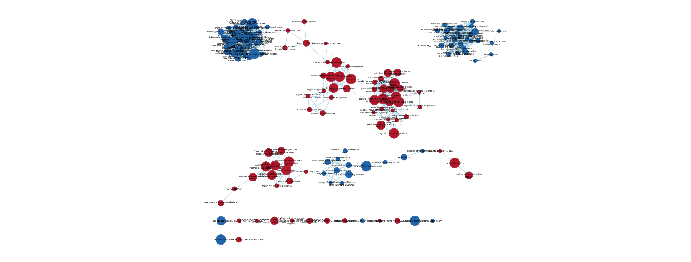
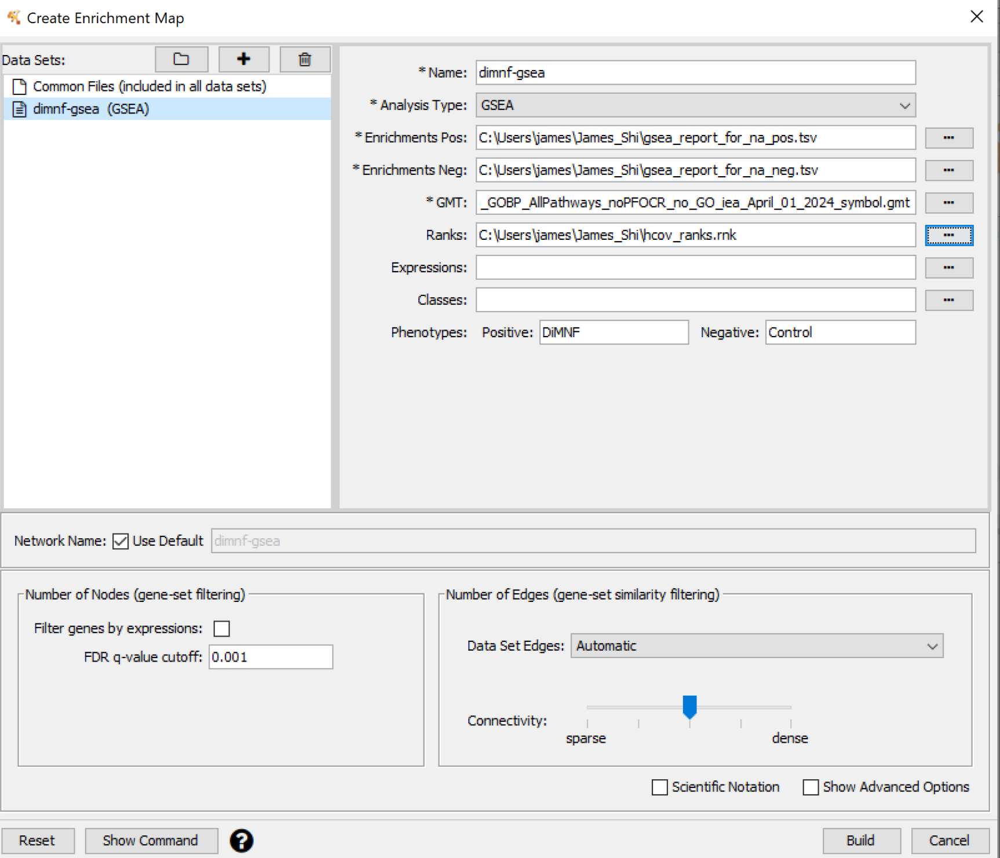
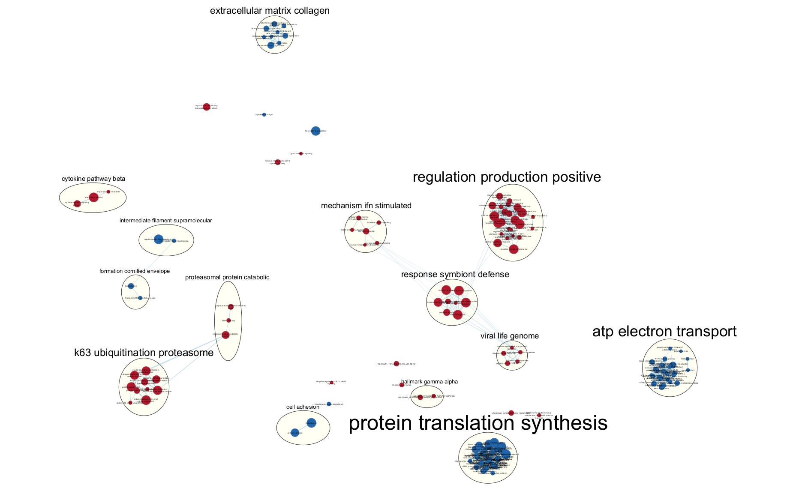
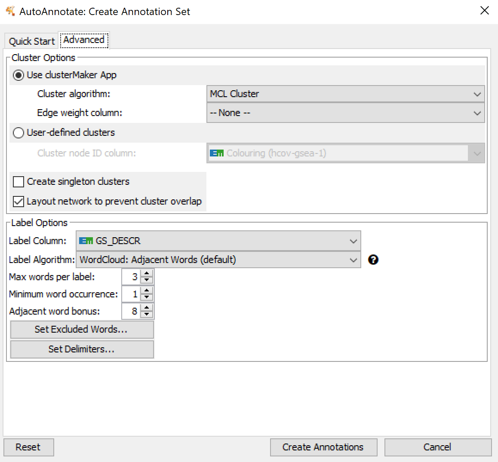
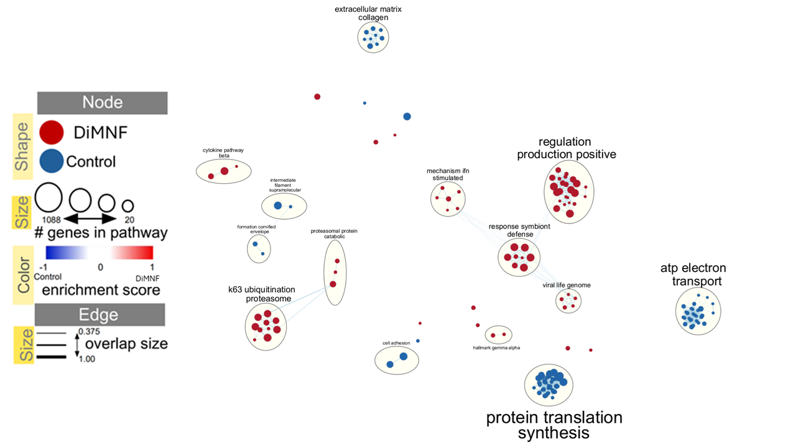
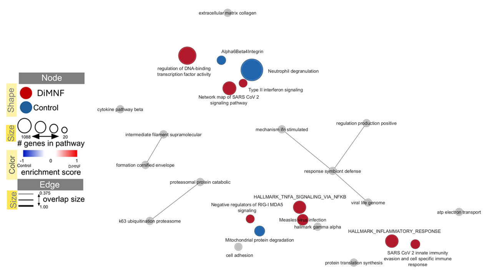
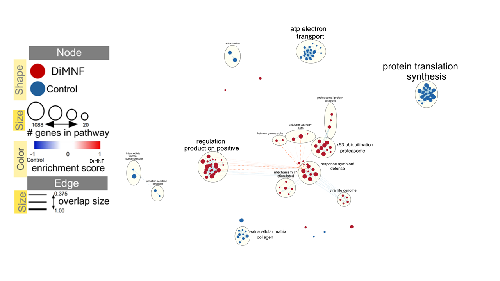

# Setting up
## Importing libraries and dependencies
This section involves importing various libraries that may be used for data analysis or to render figures. The code is configured to only install libraries if they are not already present in the environment. The code itself is not included in the html output to avoid clutter.

```{r, include = FALSE, message = FALSE, warning = FALSE}

if (!require("BiocManager", quietly = TRUE)) {
    install.packages("BiocManager") 
}

if (!require("fgsea", quietly = TRUE)) {
    install.packages("fgsea") 
}


# For GSEA later
tryCatch(expr = { library("RCurl")}, 
         error = function(e) {  
           install.packages("RCurl")}, 
         finally = library("RCurl"))


library(knitr)
library(ggplot2)
library(fgsea) # needed for gsea analysis, fast
```

Citations for libraries are as follows:

fgsea: [@korotkevich_2016_fast]

knitr: [@xie_knitr]

ggplot2: [@hadleywickham_2009_ggplot2]

## Continuing progress
This report will use a list of genes ranked by differential expression, produced at the end of A2. Since this report is intended to be independent of the previous ones, we will call the previous report A2 from within this RMarkdown file. This eliminates the need for users to individually run the previous notebooks.

```{r, include = FALSE}
rmarkdown::render("a2_james_shi.Rmd")
```


# Introduction
## Summary of Data and Research Background
Recall that these series reports work with GEO RNA-seq data with accession number **GSE237131**. The dataset is associated with a publication by Yousefi and colleagues [@yousefi_2023_betacoronaviruses]. The primary aim of the paper is to characterize the suitability of the IGROV-1 human cell line as a tool for studying coronaviruses [@yousefi_2023_betacoronaviruses]. One smaller aim in the paper is also to establish the antiviral activity of a compound called DiMNF and its efficacy against the common cold coronavirus, HCoV-OC43 [@yousefi_2023_betacoronaviruses].

The RNA-seq dataset being analyzed here addresses this aim. It was generated to assess how DiMNF treatment grants antiviral properties in cells infected with a coronavirus. Knowing the types of biological processes altered by HCoV-OC43 infection, DiMNF treatment, or both can help elucidate mechanisms for how the drug functions. These reports will help address this question.

Some basic information about the dataset is below.

**Title of study**: `r gset@experimentData@title`

**Abstract**: `r gset@experimentData@abstract`

**RNA-seq methodology**: `r unique(gset@phenoData@data$extract_protocol_ch1.1)`

**Platform ID**: `r gset@experimentData@other$platform_id`

**Most recent update**: `r gset@experimentData@other$last_update_date`

**Organism from which samples came**: `r unique(gset@phenoData@data$organism_ch1)`

## Summary of Previous Progress
In the first report, the raw counts data were loaded into R. The entrez IDs were mapped to HUGO symbols, and read count data were cleaned and normalized. The final product was a dataframe with normalized read counts for each gene (i.e. a TMM matrix). HUGO symbols were mapped to each gene. The data is also saved locally by the Rmd file. 

The second report continues from the first report. Using normalized data from A1, we used `edgeR` to perform differential expression testing, and then used `g:Profiler` to perform preliminary thresholded gene set enrichment analysis. The most important product from A2 is a list of genes ranked by the extent of their differential expression (upregulation to downregulation).

This ranked list will be our focus in this report. Using the list, we will now perform non-thresholded gene set enrichment analysis. The results will be visualized as an enrichment map using Cytoscape, and we will interpret what these results mean biologically.

# Non-Thresholded Gene Set Enrichment Analysis (GSEA)
The first processing step is non-thresholded gene set enrichment analysis. For this section, the chosen method will be GSEA. We will automate this through R using the fGSEA library.

## Automated fGSEA
The code is partially based on the [Bader Lab tutorial on running GSEA from within R](https://risserlin.github.io/CBW_pathways_workshop_R_notebooks/run-gsea-from-within-r.html). 
### Generating rank file
```{r}
# Creating a rank file based on edgeR results from A2
# generate a dataframe of gene names and ranks using formula from lecture 
rank_df = data.frame(
  GeneName = rownames(top_hits),
  ranks = sign(top_hits$logFC) * -log10(top_hits$PValue)
)

# Order the genes by descending order of rank (positive to negative)
rank_df = rank_df[order(-rank_df$ranks),]

# Write top_hits into a rank file as input into GSEA
# file = {whatever name you want}
write.table(rank_df, file = "hcov_ranks.rnk", sep = "\t", row.names = FALSE, quote = FALSE)
```

### Downloading the gmt file
```{r, message = FALSE}
# Initial value for gmt file
gene_set_file <- "Human_GOBP_AllPathways_noPFOCR_no_GO_iea_March_01_2024_symbol.gmt" 

# Download the gmt file if it doesn't already exist
if(! file.exists(gene_set_file)){
  
  # URL to get most recent gene set
  gmt_url = "http://download.baderlab.org/EM_Genesets/current_release/Human/symbol/"

  # Read the files at the URL
  filenames = getURL(gmt_url)
  tc = textConnection(filenames)
  contents = readLines(tc)
  close(tc)
  
  # Create reg expression that gets files with all pathways and no IEA
  rx = gregexpr("(?<=<a href=\")(.*.GOBP_AllPathways_noPFOCR_no_GO_iea.*.)(.gmt)(?=\">)", contents,perl = TRUE)
  
  # Get file names that match reg expression
  gmt_file = unlist(regmatches(contents, rx))
  
  # Specify path to download file
  gene_set_file <- file.path(gmt_file)
  
  # Download the file
  download.file(paste(gmt_url, gmt_file, sep=""), destfile = gene_set_file)
}
```

### Setting up important variables 
```{r}
#directory where all the data files are found. 
working_dir <- getwd()

#directory where all the data files are found. 
output_dir <- paste0(getwd(), "/output")

#The name to give the analysis in GSEA 
analysis_name <- "HCoV non-thresholded GSEA"

# Rank file to use in GSEA analysis
# For this report, it is whatever you named it in the function call to write.table above
rnk_file <- "hcov_ranks.rnk"

#path to GSEA jar 
gsea_jar <- file.path(working_dir, "GSEA_4.3.3/gsea-cli.sh")
```

### Running fgsea
```{r, warning = FALSE}
run_gsea = TRUE # Set to TRUE when ready to compile

if (run_gsea){
  # Set up ranks
  input_ranks = rank_df$ranks
  names(input_ranks) = rank_df$GeneName
  
  # call fgsea function to run GSEA
fgseaRes <- fgsea(pathways = fgsea::gmtPathways(gene_set_file), 
                  stats    = input_ranks,
                  minSize  = 15,
                  maxSize  = 500) 
}
```


```{r}
# visualize part of the results to ensure the call worked
head(fgseaRes)
```

```{r}
# Define function to process fgsea results to call at will
# Note this is supposed to emulate the format of the GSEA report files 
process_fgsea = function(pre_fgsea, pre_ranks){
  
  # Calculate RANK AT MAX (part of the file for GSEA reports)
  # Apply the function to rows (MARGIN = 1)
  ranks_at_max = apply(pre_fgsea, MARGIN = 1, FUN = function(x) {max(which(names(pre_ranks) %in% unlist(x[8])))
  })
  
  # Arrange the output columns in the order of the GSEA report file
  fgsea_res = cbind(pre_fgsea$pathway,
                    pre_fgsea$pathway,
                    "Details ...",
                    pre_fgsea$size,
                    pre_fgsea$ES,
                    pre_fgsea$NES,
                    pre_fgsea$pval,
                    pre_fgsea$padj,
                    0,
                    ranks_at_max,
                    "Not available"
                    )
  # The "not available" goes into the leading edge column
  # It's not used but we can put a dummy here as a placeholder
  
  # Name the columns appropriately
  colnames(fgsea_res) =  c("NAME", "Description", "GS DETAILS", "SIZE", 
  "ES", "NES", "pval", "FDR", "FWER", "RANK AT MAX", "LEADING EDGE")
 
  # throw it back
  return(fgsea_res)
}
```


```{r}
# Store the positive and negative gene sets as .tsv for Cytoscape later
# Format the results
top_pos_pathways = process_fgsea(fgseaRes[fgseaRes$NES > 0], input_ranks)
top_neg_pathways = process_fgsea(fgseaRes[fgseaRes$NES < 0], input_ranks)

# Download as .tsv for Cytoscape later
write.table(top_pos_pathways,
            file = "gsea_report_for_na_pos.tsv", sep = "\t",
            row.names = FALSE,
            quote = FALSE)

write.table(top_neg_pathways,
            file = "gsea_report_for_na_neg.tsv", sep = "\t",
            row.names = FALSE,
            quote = FALSE)
```

```{r}
# Visualize the top 30 gene sets of each list as was done in A2
# Ignore 
# Top 30 upregulated gene sets by significance
kable(fgseaRes[NES > 0][order(fgseaRes[NES > 0]$padj), ][1:30, c("pathway", "padj")],
      caption = "**Table 1 - Top 30 most significant enriched gene sets in DiMNF group**",
      formal = pipe,
      digits = 30)

# Top 30 downregulated gene sets by significance
kable(fgseaRes[NES < 0][order(fgseaRes[NES < 0]$padj), ][1:30, c("pathway", "padj")],
      caption = "**Table 2 - Top 30 most significant gene sets enriched in control**",
      formal = pipe,
      digits = 30)
```

## Interpretation questions for GSEA

1. What method did you use? What genesets did you use? Make sure to specify versions and cite your methods.

**Answer**: The method I used is GSEA v4.3.3, automated using the `fGSEA` library in R [@korotkevich_2016_fast]. Gene sets came from the predefined `Human_GOBP_AllPathways_noPFOCR_no_GO_iea_April_01_2024_symbol.gmt` file downloaded programmatically from the Bader Lab. Note the gmt version date of April 01, 2024. The Bader Lab recompiles the gene sets monthly, so if one were to run the code a month from now, the GMT file will automatically update. Input data involved a rank file made from edgeR differential expression results. The file includes the gene name (HUGO symbols) and a rank calculated from its pvalue and logFC.

2. Summarize your enrichment results.

**Answer**:
```{r}
nrow(fgseaRes) # number of gene sets outputted
```
There are a total of `r nrow(fgseaRes)` gene sets in the fGSEA output.

Among those, only 3772 gene sets are considered enriched in the DiMNF treated phenotype based on NES > 0. If we apply a threshold of padj < 0.1 as was done in the source paper, then 339 of those gene sets would be considered significant.
```{r}
nrow(fgseaRes[NES > 0]) # positive (DiMNF) phenotype gene sets
nrow(fgseaRes[NES > 0][padj < 0.1]) # significant
```
Based on Table 1, the trend among the most significant gene set terms seem to be immune defense or signalling terms. Examples include "defense response to virus", "interferon alpha response", and similar terms.

In contrast, 1851 gene sets are considered enriched in the control phenotype based on NES < 0. Applying the same threshold of padj < 0.1, 315 of these gene sets are considered significant.
```{r}
nrow(fgseaRes[NES < 0]) # control phenotype gene sets
nrow(fgseaRes[NES < 0][padj < 0.1]) # significant
```
Based on Table 2, the trend among the most significant control gene sets seem to be related to translation. Examples include "protein synthesis: (various amino acids)", "initiation", "elongation", "termination.

3. How do these results compare to the results from the thresholded analysis in Assignment #2. Compare qualitatively. Is this a straight forward comparison? Why or why not?

**Answer**: There are both striking similarities and differences with the thresholded `g:Profiler` analysis from A2. Recall that in A2, the trends were that the upregulated gene sets tend to concern defenses against foreign invaders. This is still true in our non-thresholded analysis. There are many terms in common such as "defense response to virus" or "defense response to symbiont". This makes sense as DiMNF treatment reportedly should boost immune defense expression. The main differences are in the downregulated gene sets. In A2, these gene sets were mostly processes related to development or cytoskeleton organization. Examples included "tissue development" or "intermediate filament organization". However, the non-thresholded results seem to focus heavily on translation. Most of the enriched terms in the control group relate to the process of translation itself or on the metabolism of the 20 amino acids. Although the terms themselves may be different, the biological meaning is unclear. Many of the immune system weapons (like antibodies) are peptides that require translation, so the infected control cells may be producing defenses. However, it is not clear why these genes are only enriched in the control group and not the DiMNF group. This could be a point of further investigation.

The comparison is not straightforward in that different gene sets were used. For g:Profiler, we used GO:BP, WikiPathways, and Reactome. For GSEA, only GO:BP pathways were used.


# Visualization using Cytoscape
The desktop Cytoscape app will be used for this analysis. This section will take the GSEA results generated above and visualize the gene sets that are enriched.
## Method
There are 4 input files into Cytoscape:

1. `Human_GOBP_AllPathways_noPFOCR_no_GO_iea_April_01_2024_symbol.gmt`

2. `gsea_report_for_na_pos.tsv`

3. `gsea_report_for_na_neg.tsv`

4. `hcov_ranks.rnk`

These files were all generated and locally saved by the code from the `fGSEA` pipeline above. The exception is the GMT file, which the code downloads from the Bader Lab website.

## Interpretation Questions

1. Create an enrichment map - how many nodes and how many edges in the resulting map? What thresholds were used to create this map? Make sure to record all thresholds. Include a screenshot of your network prior to manual layout.



There are 177 nodes and 2241 edges in the resulting map. The FDR cutoff was set to 0.001, and the edge cutoff is the default value of 0.375. The parameters to render this map are below:



Figure 1 is as rendered right after building, showing all nodes and edges but before any manual manipulation. 

A few notes about how to interpret the map in Figure 1:

- Each node is a gene set, and the size of the node reflects the gene set size

- Red = phenotype enriched for HCoV-OC43 infection, blue = control

- Edges = shared genes between two sets (indicated by a number on the edge)

2. Annotate your network - what parameters did you use to annotate the network. If you are using the default parameters make sure to list them as well.



I annotated the enrichment map using AutoAnnotate and default parameters. These parameters use the clusterMaker MCL clustering algorithm, with no edge weights. The parameters are displayed below. Note that layering the clusters is important to avoid lots of overlap and clutter in the map.



3. Make a publication ready figure - include this figure with proper legends in your notebook.



4. Collapse your network to a theme network. What are the major themes present in this analysis? Do they fit with the model? Are there any novel pathways or themes?

 

The major themes include immune defense responses, signalling pathways related to immune responses, cytoskeleton and cell adhesion organization. Some minor themes include metabolism (ATP electron transport) or protein homeostasis (translation or K63 ubiquitination).

These themes do fit with the findings in the source paper, which state that DiMNF treatment grants antiviral properties by altering cell expression of immune genes [@yousefi_2023_betacoronaviruses]. Indeed, many of the DiMNF enriched theme nodes seem to be immune related, so they support the authors' idea that DiMNF is boosting expression of immune genes. 

The control group enriched themes are sometimes unexpected. I did not previously know of the immune functions of shunting translation or collagen, so I thought they were novel pathways. However, after looking into the literature, it seems they have well defined roles in immunity. Collagen is degraded to allow for immune cell migration, so you want less collagen during pathogen attack [@schwarz_2022_targeting]. The control group being enriched in collagen makes sense, as they are less primed for defense. However, translation is generally lower in infected cells, so it is not clear why the vulnerable control group is actually enriched in translation genes [@shehata_2024_mechanisms].


# Interpretation of overall results

1. Do the enrichment results support conclusions or mechanism discussed in the original paper? How do these results differ from the results you got from Assignment #2 thresholded methods?

The enrichment results seem generally consistent with the authors' reported conclusions. In the source paper by Yousefi and colleagues, they claim that DiMNF upregulates interferon-stimulated genes, which are basically genes involved in immune defense [@yousefi_2023_betacoronaviruses]. Looking at the enriched gene sets in the DiMNF group, most of the gene sets are indeed related to defenses, as shown in Figure 5. 

The enrichments for the control group seem strange considering the authors' proposal. Some gene sets, such as translation, are enriched in the control group despite the literature suggesting the opposite [@shehata_2024_mechanisms]. 

When comparing the g:Profiler ORA results from A2 with the GSEA results here, there are many similarities. Both methods identified the immune defense terms to be enriched. The ORA also identified some cytoskeletal and extracellular matrix genes which were encapsulated by the control group enriched gene sets, in addition to translation-related genes. Overall, it seems that GSEA is more comprehensive than the g:Profiler ORA.

It is harder to comment on the ORA results from downregulated genes both because the source paper lacked commentary on them, and because the chosen RNA-seq dataset was targeted towards a relatively smaller aim within the research project.


2. Can you find evidence, i.e. publications, to support some of the results that you see. How does this evidence support your result?

For the DiMNF group, the connection between enrichment of terms like "defense to virus" or "defense to symbiont" and DiMNF is clear. For example, Figure 5 shows "mechanism ifn (interferon)" as a major group. One paper reports interferons as a key signalling event against mucosal pathogens [@walker_2021_differential]. Enrichment of other terms is also supported in the literature. For example, one major enrichment group is K63 ubiquitination. A paper reports that the K63 Ub modification controls many key immune responses, and coronaviruses often attempt to shunt this event to promote infection [@madiraju_2022_k63]. Thus, DiMNF upregulating this would make sense. DiMNF also upregulates other important defenses like interferon and cytokine signalling pathways. 

The collagen genes are enriched in the control group, which could make sense as collagen is generally degraded during infection to allow for immune cell mobility [@schwarz_2022_targeting]. The control group is less primed for defense and may not be executing this response as much. The examples thus far all support the results we see.

There are also publications that seem contradictory with our results. For example, viral infection generally reduces host translation [@shehata_2024_mechanisms]. However, these gene groups are actually enriched in the control group, which has infected cells but no DiMNF. It seems to make no sense why these genes would be enriched when they should be downregulated. One possibility is that the summary terms were imprecise, and if we were to carefully examine.


## Post-analysis
The post-analysis will focus on gene sets that seem to interact with the JAK/STAT signalling pathway. The source paper focused on the aryl-hydrocarbon receptor (AHR), whose signalling seems to be pro-viral. The JAK/STAT singalling pathway, which leads to the STAT transcription factors activating important immune genes, has been shown to interact with AHR [@sondermann_2023_functions]. Specifically, when agonists activate AHR, this in turn inhibits the JAK pathway, which shunts immune defenses and aids viral attack [@sondermann_2023_functions]. 



Figure 7 shows that many of the upregulated gene sets, whose themes relate to immune defense, are also either members of JAK/STAT signalling or may be targets of the activating STAT transcription factors. This makes sense as the authors claimed that DiMNF is an AHR antagonist that prevents its function, which we would expect would increase JAK/STAT activity. This in turn leads to many upregulated immune gene sets, as seen in Figure 7. This post-analysis helps add some confidence to both our GSEA results and the authors' claims. It seems that DiMNF treatment is indeed boosting the cell's basal immunity via gene expression changes, shown by its close connection with JAK/STAT activity.

# References

