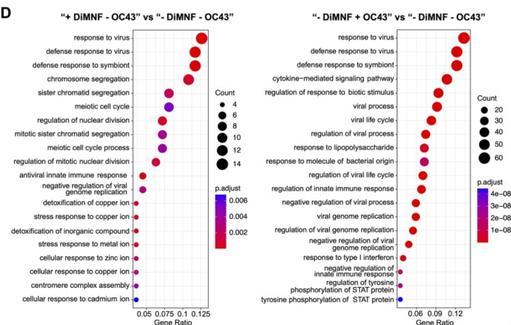

# Brief Summary of Assignment 1
This report extends work done in A1. In the last report, we imported raw RNA-seq counts data from a GEO dataset with accession number *GSE237131*. The data were generated for a paper investigating the use of a possible antiviral, DiMNF, in combatting coronaviruses causing the common cold [@yousefi_2023_betacoronaviruses]. The RNA-seq dataset used was to investigate the effect of viral infection and/or use of DiMNF on the gene expression of epithelial cell lines [@yousefi_2023_betacoronaviruses]. Seeing how DiMNF modulates gene expression may point to a mechanism for its antiviral activity.

In the report for A1, the raw counts data were downloaded programmatically and cleaned. Since the dataset initially used entrez IDs, they were mapped to HUGO symbols using the *biomaRt* package. Examples of cleaning involved removing low read count genes and removing duplicate or nonexistent HUGO symbols. The data were then normalized and installed as a TMM counts file. The initial raw counts file started with 39376 genes. After all processing steps, 13543 genes were left in the final dataset.

# Objective of Assignment 2
In this report, we will perform differential expression testing on the cleaned data generated in A1. We will then perform over-representation analysis (ORA) on genes identified to be differentially expressed. The data were saved locally as a .txt file which can be accessed programatically. 

# Setting up
## Installing packages and dependencies
First, we will install some packages that may be useful in our analyses. The code is configured to only install them if they are not already present in the environment.
```{r, include = FALSE}
# Installing packages
# BiocManager
if (!require("BiocManager", quietly = TRUE)) {
    install.packages("BiocManager") 
}

if (!require("GEOquery", quietly = TRUE)) {
    install.packages("GEOquery") 
}

# Independent packages
if (!require("edgeR", quietly = TRUE)) {
    install.packages("edgeR") 
}

# Loading packages into the environment
library(gprofiler2)

# R built-in packages
library(ComplexHeatmap) # R built-in
library(knitr) # R built-in
library(circlize) # R built-in
library(ggplot2) # R built-in
```
Citations for the libraries used in this report are as follows:

[@robinson_2009_edger]
[@gu_2014_circlize]
[@xie_2021_a]
[@kolberg_2020_gprofiler2]
[@wickham_2016_ggplot2]
[@gu_2022_complex]
[@davis_2007_geoquery]
[@kolberg_2023_gprofilerinteroperable]

## Loading in the normalized data
First, we will load in the cleaned and normalized data. Recall that the data has an accession code of *GSE237131* [@yousefi_2023_betacoronaviruses].

```{r, include = FALSE}
# Eliminate need for user to run the previous notebook
rmarkdown::render("a1_james_shi.Rmd")

# Importing the data
acc_id = "GSE237131"
file_name = "GSE237131_filt_TMM_norm_counts.txt"

normalized_counts = read.table(file = file.path(file_name), header = TRUE, sep = "\t", stringsAsFactors = FALSE)
```
By default, the data is imported as a dataframe containing TMM normalized counts. The genes are sorted in alphabetical order by HUGO symbol. In assignment 1, any duplicate HUGOs were dealt with, so every row is a unique gene.


## Choosing model design based on MDS plot
Before engaging with differential expression, it is important to consider the factors we want to use to group the samples. The ideal factor would demonstrate consistent clustering by that factor when graphed on a multidimensional scaling (MDS) plot. Thus, we can make several MDS plots to guide our choice.

First, we import and derive sample information from the metadata file, which was saved locally from A1. We use the sample information to generate the treatment factors by which data will be grouped in the MDS plot.


```{r}
# Check for preexistence of the metadata 
if (! file.exists(paste0(acc_id,".RData"))) {
  gset <- GEOquery::getGEO(acc_id,GSEMatrix =TRUE,getGPL=FALSE)
  saveRDS(gset, paste0(acc_id, ".RData"))
} else {
  gset <- readRDS(paste0(acc_id, ".RData"))
}
gset <- gset[[1]]

# From A1, obtain sample info
sample_info = gset@phenoData@data[, c("organism_ch1", "characteristics_ch1", "characteristics_ch1.1", "characteristics_ch1.3", "genotype:ch1")] # Extract the most useful columns
colnames(sample_info) = c("Organism", "Cell line", "Cell type", "Treatment", "Genotype") # Assign meaningful names

# Derive the factors 
dge_list = DGEList(as.matrix(normalized_counts), group = sample_info$Treatment)

# Obtain factors
norm_factors = calcNormFactors(dge_list)
```


Later, normalized counts will be compared across conditions to determine the effect of treatment on gene expression. Recall there are 4 conditions:
1. no infection, DMSO media (control)
2. no infection, DiMNF inhibitor (test condition for DiMNF)
3. OC43 infection with DMSO media (test for infection effects)
4. OC43 infection + DiMNF inhibitor (test for antiviral effects of DiMNF)

Below is the MDS plot when grouped by treatment factor.
```{r, fig.cap= "<b> Figure 1 :</b> A multidimensional scaling plot demonstrating how samples with the same treatment cluster together and remain distinct from those with different treatments"}
# MDS plotting
# Based on code from lecture and from A1
# MDS plotting is from the Limma package
limma::plotMDS(norm_factors, labels=NULL, pch = 1,
col = c("darkgreen","blue", "red", "purple")[factor(sample_info$Treatment )]) 
# Group by treatment

# Creating a legend
legend("topright",
legend=levels(factor(sample_info$Treatment )),
pch=c(1), col = c("darkgreen","blue", "red", "purple"),title="Class",
bty = 'n', cex = 0.75)
```

We can also visualize separation of samples when we group them by different factors.

Consider an MDS plot grouped by cell line.
```{r, fig.cap= "<b> Figure 2 :</b> A multidimensional scaling plot demonstrating how samples do not cluster together despite sharing the same cell line"}
# Derive the factors 
dge_list = DGEList(normalized_counts, group = sample_info$Treatment)

# Obtain factors
norm_factors = calcNormFactors(dge_list)
limma::plotMDS(norm_factors, labels=NULL, pch = 1,
col = c("darkgreen","blue", "red", "yellow")[factor(sample_info$`Cell line`)]) 
# Group by treatment

# Creating a legend
legend("topright",
legend=levels(factor(sample_info$`Cell line` )),
pch=c(1), col = c("darkgreen","blue", "red", "yellow"),title="Class",
bty = 'n', cex = 0.75)
```

Also consider an MDS plot when samples are grouped by the genotype factor.
```{r, fig.cap= "<b> Figure 3 :</b> A multidimensional scaling plot demonstrating how samples with the same genotype do not cluster together"}
limma::plotMDS(norm_factors, labels=NULL, pch = 1,
col = c("darkgreen","blue", "red", "yellow")[factor(sample_info$Genotype )]) 
# Group by treatment

# Creating a legend
legend("topright",
legend=levels(factor(sample_info$Genotype )),
pch=c(1), col = c("darkgreen","blue", "red", "yellow"),title="Class",
bty = 'n', cex = 0.75)
```

Examining the MDS plots, it is clear that treatment is the only viable factor for differential expression analyses. When grouped by treatment, all samples with the same treatment cluster together on the MDS plot, but one treatment cluster is different from all other treatment clusters. For example, the OC43 infected + DMSO group clusters together, but is quite different from the OC43 infected + DiMNF group. This clustering pattern indicates an ideal factor choice.

The other factors did not demonstrate consistent clustering, so they do not need to be considered. One could have anticipated this given that the genotype and cell line were identical for all samples. The MDS plots are simply a check.

## Creating model design
Having chosen treatment as the factor, we can design the input model matrices for edgeR's differential expression analysis. The model will use treatment as the only factor.

```{r}
# All functions below are from edgeR
model_design = model.matrix(~ sample_info$Treatment)
d = estimateDisp(norm_factors, model_design)
fit = glmQLFit(d, model_design)
```
# Differential expression testing


```{r}
# Perform DGE testing with edgeR
qlf.ctrl_vs_inf = glmQLFTest(fit, coef = ncol(model_design))

# Store results
# topTags() is from edgeR
qlf.ctrl_vs_inf.res = topTags(qlf.ctrl_vs_inf, n = nrow(normalized_counts))

# Store in a table
top_hits = qlf.ctrl_vs_inf.res$table
```

### Multiple testing correction
For this analysis we will set a significance threshold of p < 0.1. This is the threshold used in the source paper, so for consistency we will adopt the same threshold.

Initially, there are `r nrow(top_hits)` genes.

First, let's see how many genes pass this threshold.
```{r}
# Genes that appear significant before correction
length(which(top_hits$PValue < 0.1))
```
Before any multiple testing correction, `r length(which(top_hits$PValue < 0.1))` genes are significantly differentially expressed. As a proportion of the total number of tested genes, this means `r (length(which(top_hits$PValue < 0.1)) * 100) / nrow(top_hits)`% of genes were differentially expressed. 

Now we apply false discovery rate (FDR) correction to account for multiple testing.
```{r}
# Genes that survive correction
length(which(top_hits$FDR < 0.1))
```
After correction, `r length(which(top_hits$FDR < 0.1))` genes survived. As a percentage of the total number of tested genes, `r (length(which(top_hits$FDR < 0.1)) * 100) / nrow(top_hits)`% of genes are differentially expressed after FDR correction.

FDR correction is used to address the fact that a large number of genes were tested in this analysis. The choice of FDR over Bonferroni stems from a review by Noble [@noble_2009_how]. According to this review, the Bonferroni method is too strict in most cases, so using FDR would include more genes after correction [@noble_2009_how]. This would reduce the risk of excluding genes that had interesting changes in expression. Also, based on the recommendations of the Noble review, it seemed that choosing FDR is better in the absence of a clear reason to use Bonferroni. Implementation of FDR correction is also very easy because edgeR's function `glmQLFTest()` calculates the FDR by default.


## Plotting
There are various plots that can be used to visualize the results of this testing.

### Volcano plot
A volcano plot is one simple way to visualize which genes are differentially expressed in the analysis.

For our plot, we will define significant differential expression based on two thresholds: FDR and log2FC. Genes will be considered significant when FDR < 0.1 and |logFC| > 1. These thresholds are derived from those used in the source paper by Yousefi and colleagues (citation). Upregulated genes have a positive log2FC, while downregulated genes have a negative log2FC. Upregulated genes are in the upper right corner, while downregulated genes are in the upper left corner.

```{r, fig.cap= "<b> Figure 4 :</b> Volcano plot showing downregulated and upregulated genes given thresholds of -log(FDR) < 0.1 and |logFC| > 1. Downregulated genes are colored blue in the upper-left quadrant. Upregulated genes are colored red in the upper-right quadrant."}
# Label data based on differential expression
# By default, add a column of no change in expression ("NO)
top_hits$diffexpressed = "NO"
# Set those with upregulation to "UP" by defined thresholds
top_hits$diffexpressed[top_hits$logFC > 1 & top_hits$FDR < 0.1] = "UP"
# Set downregulated genes to "DOWN"
top_hits$diffexpressed[top_hits$logFC < -1 & top_hits$FDR < 0.1] = "DOWN"


# Making the actual plot
# Define a vector of colors
colors = c("blue", "black", "red")
names(colors) = c("DOWN", "NO", "UP")

# Form the volcano plot, which is really a modified scatterplot
ggplot(data=top_hits, 
       aes(x=logFC, y=-log10(FDR), col=diffexpressed)) +
        geom_point() + 
        theme_minimal() +
        scale_color_manual(values= colors) +
        geom_vline(xintercept=c(-1, 1), col="red") + # visual cutoff for logFC
        geom_hline(yintercept=-log10(0.1), col="red") # visual cutoff for FDR
```

### Heatmap
The top hits are also visualized using a heatmap.

We create a heatmap by first finding the subset of top hits (genes whose FDR is < 0.1). We generate a matrix of scaled counts data from this subset as it was originally a data frame. The matrix is used to generate a color gradient from blue (downregulation) to red (upregulation).
```{r, message = FALSE}
# This code uses the ComplexHeatmap dependency
# Restrict heat map to top hits
# Find significant genes
heatmap_top_hits = rownames(top_hits)[top_hits$FDR < 0.1] # threshold from source paper

# Retrieve their indices in normalized_counts
top_hits_ix = which(rownames(normalized_counts) %in% heatmap_top_hits)

# Create scaled data based on the top hits only
heatmap_matrix = t(scale(t(as.matrix(normalized_counts[top_hits_ix,]))))

# Generate color gradient based on the values in the matrix
# Based on lecture code
if(min(heatmap_matrix) == 0){ # Red for positives
heatmap_col = colorRamp2(c( 0, max(heatmap_matrix)),
c( "white", "red"))
} else { # Blue for negatives
heatmap_col = colorRamp2(c(min(heatmap_matrix), 0,
max(heatmap_matrix)), c("blue", "white", "red"))
}

# Generate annotations
# Set up treatment type
unique_treatment = unique(sample_info$Treatment)
unique_treatment_cols = rainbow(n = length(unique_treatment))
names(unique_treatment_cols) = unique_treatment

# Make the actual annotations
annot_pat = HeatmapAnnotation(treatment = sample_info$Treatment,
                              col = list(treatment = unique_treatment_cols),
                              show_legend = TRUE)

# Generate the actual heat map
current_heatmap <- Heatmap(heatmap_matrix,
                           top_annotation = annot_pat,
show_row_dend = TRUE, # draw dendrogram to show row (gene) relationships
show_column_dend = TRUE, # draw dendrogram to show column (sample) relationships
col=heatmap_col, # color gradient
show_column_names = TRUE,
show_row_names = FALSE, # hide gene names because there's too many to render
show_heatmap_legend = TRUE,
cluster_rows = TRUE,
cluster_columns = TRUE,
column_title = ("Top hits after OC43 infection and/or DiMNF")) 

```
The product heatmap is visualized below.
```{r , fig.cap= "<b> Figure 5 :</b> Heatmap showing regulation changes among genes exhibiting significant differential expression defined by FDR < 0.1. Clustering of samples based on treatment is visualized by colored annotations on the top. Downregulated genes are in blue and upregulated genes are in red."}
current_heatmap
```

The heatmap shows that samples belonging to the same condition cluster together nicely. The heatmap also visually affirms some findings from the paper. For example, the OC43 infected samples have a very different expression profile from the control samples. However, addition of the antiviral DiMNF to the OC43 infection restored an expression profile very similar to the control sample. This suggests that DiMNF was effective in combating HCoV-OC43 infection, which is expected as the authors concluded the same thing in the paper. The authors also report that DiMNF has low cytotoxicity. This is seen in how the control samples are similar to the mock infection + DiMNF samples, suggesting that DiMNF has little impact on basal cell activity, although a different set of genes are downregulated. Overall, the heatmap is consistent with trends described in the paper.

# Thresholded over-representation analysis
To begin over-representation analysis (ORA), we will first create lists of upregulated and downregulated genes.

Fortunately, when creating the volcano plot earlier, genes that were considered significantly differentially expressed were already annotated with "DOWN" or "UP" in the data frame. We can use these labels to isolate the HUGO symbols for these subsets. Also recall that these genes were defined as significant based on FDR < 0.1 and |logFC| > 1, as was done in the source paper.
```{r}
up_genes = rownames(top_hits)[which(top_hits$diffexpressed == "UP")]
  
down_genes = rownames(top_hits)[which(top_hits$diffexpressed == "DOWN")]
```

We will programatically use g:Profiler to run ORA. The annotation datasets will be Reactome, WikiPathways, and Gene Ontology Biological Pathways. Several factors motivate this choice. First, we have prior experience working with g:Profiler, which means lower chances of making mistakes. Also, g:Profiler has a simple online interface so one can verify results between the code and the website. It is also able to integrate many annotation datasets to perform a comprehensive ORA [@kolberg_2023_gprofilerinteroperable].

The source paper only used GO biological pathways. However, I decided to include Reactome and WikiPathways for more inclusive results. By including more data sources, we are less likely to miss interesting gene set terms, since Reactome and WikiPathways are big datasets. Also, the maintenance of data source versions is handled by `g:Profiler`. The last update was in Jan 2024. It is possible that something in GO:BP may have changed since then, but changes in one data source are less adverse if one includes multiple data sources.

The source versions are as follows:

**GO:BP**: updated 2024-01-17
**REAC**: 2024-01-05
**WP**: 2024-03-12
```{r}
# Wrap the g:Profiler query as a function to call it at will
goprof_query = function(gene_list) {
  res = gost(query = gene_list,
              organism = "hsapiens",
              significant = FALSE,
              exclude_iea = TRUE,
              correction_method = "fdr",
              source = c("REAC", "WP", "GO:BP"))
  return(res$result)
}
```

Notice that the `gost` function returns a data frame sorted in order of decreasing significance. That is, the most enriched terms will always appear at the top and be seen first.

## Pre-threshold exploratory analysis
First, we query the upregulated genes. 
```{r}
up_genes_res = goprof_query(up_genes)
head(up_genes_res[, c('p_value', 'term_name')]) # preview
```
Next, we query the downregulated genes.
```{r}
down_genes_res = goprof_query(down_genes)
head(down_genes_res[, c('p_value', 'term_name')])
```

Finally, we query the entire list of differentially expressed genes.
```{r}
all_genes_res = goprof_query(c(up_genes, down_genes))
head(all_genes_res[, c('p_value', 'term_name')])
```

We can visualize the number of gene sets returned in each case before any thresholds:

**Gene sets in downregulated genes**: `r nrow(down_genes_res)`

**Gene sets in upregulated genes**: `r nrow(up_genes_res)`

**Gene sets in all differentially expressed genes**: `r nrow(down_genes_res) + nrow(up_genes_res)`

## Applying thresholding
We will apply a threshold of p < 0.1 to the returned gene sets. Also note that our `g:Profiler` query has already performed multiple testing correction to the returned p-values in the data frames, so there is no need for further adjustment.

```{r}
# filter gene sets based on p < 0.1
filt_up_genes = up_genes_res[up_genes_res$p_value < 0.1,]
filt_down_genes = down_genes_res[down_genes_res$p_value < 0.1,]
filt_all_genes = all_genes_res[all_genes_res$p_value < 0.1,]
```


```{r}
nrow(filt_down_genes)
nrow(filt_up_genes)
nrow(filt_all_genes)
```
The number of gene sets that survive thresholding is substantially less than the initial number of gene sets. This is expected as the `g:Profiler` query included many non-significant gene sets with p-values near 1.

**Gene sets for downregulated genes after threshold**: `r nrow(filt_down_genes)`

**Gene sets for upregulated genes after threshold**: `r nrow(filt_up_genes)`

**Gene sets for all genes after threshold**: `r nrow(filt_all_genes)`

## Comparing specific gene set terms
Consider the top 30 significant gene set terms from each query, as defined by having the lowest p_values out of all terms with p < 0.1. We chose the cutoff at 30 arbitrarily to illustrate an example.
```{r}
# knitr 
kable(filt_up_genes[1:30, c("p_value", "term_name")], 
      row.names = FALSE, 
      caption = "**Table 1 - Top significant gene set hits for upregulated genes**",
      digits = 37,
      formal = "pipe")

kable(filt_down_genes[1:30, c("p_value", "term_name")], 
      row.names = FALSE, 
      caption = "**Table 2 - Top significant gene set hits for downregulated genes**",
      digits = 10,
      formal = "pipe")

kable(filt_all_genes[1:30, c("p_value", "term_name")], 
      row.names = FALSE, 
      caption = "**Table 3 - Top significant gene set hits for all differentially expressed genes**",
      digits = 30,
      formal = "pipe")
```

The tables of the top ranking terms from each gene set show that there is high overlap between terms from upregulated genes and terms from the whole list. Top ranking terms from downregulated genes seem pretty different from the other two lists. 

Notably, many of the top terms in upregulated genes and all genes are immune/foreign invasion response terms. For example, "response to virus" is at the top of both lists, which makes sense as the experimental treatment was a viral infection. Closely following this are terms like "response to symbiont" or "respones to other organism". In contrast, the downregulated gene set terms involve growth and development such as "tissue development". Intuitively, this makes sense as when cells come under pathogen attack, they will upregulate defense systems and downregulate development since defense becomes first priority. 

# Interpretation questions
1. Do the over-representation results support conclusions or mechanism discussed in the original paper?

*Answer*: Yes, many of the top-ranking terms found in our enrichment results were also among the top hits found by the authors. Consider the following figure from the source paper outlining top pathway hits in upregulated genes among DiMNF treated or OC43 infected cells.



Notice how many of the enriched terms (big red circles on the right side of each graph) match the top terms we found, such as "response to virus" or "defense response to symbiont". The results of our ORA support the authors' conclusion, as well as what one may know from general immunology, that viral infection upregulates many immune response related terms.

One of the major findings in the paper was that DiMNF's antiviral mechanism is it boosts the cell's basal immune response. Both our results and the authors' results back this up, as DiMNF treatment has many immune responses among the enriched terms. It also modulates the cell's gene expression profile as the authors suggest, as opposed to directly acting on the pathogen itself.

The authors did not analyze enrichment within downregulated genes, so we cannot make any comparisons with their conclusions.


2. Can you find evidence, i.e. publications, to support some of the results that you see. How does this evidence support your results.

*Answer*: Yes, we already discussed how the source paper concurs with the results seen in this report. Aside from the source paper, another paper by Singh and colleagues also matches some of the results [@singh_2021_network]. It is already clear that terms related to defense against viruses is already upregulated. Part of the authors' findings is also that interferon-related genes are enriched in upregulated genes [@yousefi_2023_betacoronaviruses]. This is also reported in the Singh paper [@singh_2021_network]. In our results, one high-ranking term is "response to cytokine" which matches what these literature are reporting.

It seems that there isn't much research on enrichment in downregulated genes, so it is harder to find other sources on those. However, note that most of our enriched terms in the downregulated genes relate to proliferation, development, and metabolism. The Singh paper reports that in response to infection, pathways related to ribosomes, mitochondria, and the mTOR pathway are downregulated [@singh_2021_network]. These are all essential metabolic regulators, and mTOR specifically controls proliferation as well [@singh_2021_network]. Thus, the Singh paper could support results for the downregulated enrichment data too.


# References


